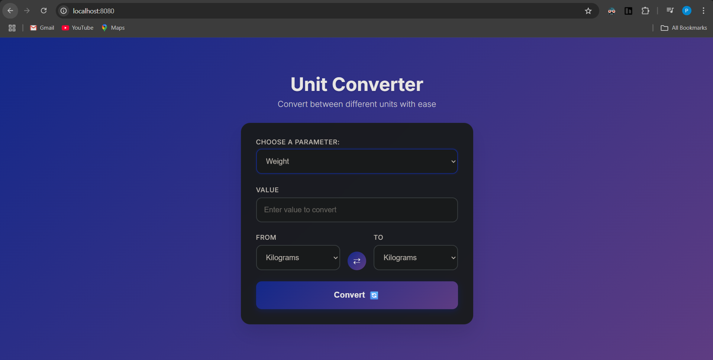

# Unit Converter

A simple web-based unit converter built with Go and Gin framework.



## Features

- Convert between length, weight, and temperature units
- Clean and responsive web interface
- Dynamic dropdown menus that update based on parameter selection

## Supported Units

**Length:** meters, feet, inches, kilometers, centimeters, millimeters, yards, miles

**Weight:** kilograms, grams, pounds, ounces, tons, stones

**Temperature:** celsius, fahrenheit, kelvin

## How to Run

1. Make sure you have Go installed
2. Clone or download this project
3. Install dependencies:
   ```bash
   go get github.com/gin-gonic/gin
   ```
4. Run the application:
   ```bash
   go run main.go
   ```
5. Open your browser and go to `http://localhost:8080`

## Usage

1. Select a parameter type (Length, Weight, or Temperature)
2. Enter the value you want to convert
3. Choose the source and target units
4. Click "Convert" to see the result

## Project Structure

```
unit-converter/
├── main.go           # Main Go application
├── templates/
│   └── index.html    # HTML template
├── static/
│   └── style.css     # CSS styles
└── README.md
```
